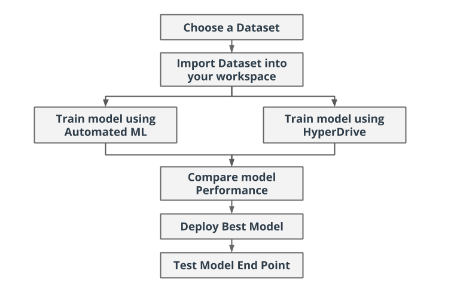

# Hearth Failure Prediction using Azure Machine Learning

This project is a capstone project for Udacity's Machine Learning Engineer for Microsoft Azure Nanodegree. In this project, a classification model was trained to predict the event of hearth failure. There were two method used to create the model which were Azure Automated ML and Hyperdrive Run. 

The performance of both models were compared and the best model was choosen based on the accuracy. This model then deployed using Azure Container Instances (ACI) and can be consumed using HTTP request through REST endpoint.

The diagram of this project can be seen below:


## Project Set Up and Installation
This project was done in Azure Environment provided by Udacity. 

## Dataset

### Overview
This project use Hearth Failure Dataset from Kaggle that can be acquired from this [link](https://www.kaggle.com/andrewmvd/heart-failure-clinical-data). This dataset contains thirteen columns related to hearth failure.

### Task
The occurence of death was predicted using twelve features outlined in the dataset. These features were:
- age (int): self explanatory
- anaemia (bool): whether there has been a decrease of red blood cells or hemoglobin
- creatinine_phosphokinase (int): level of the CPK enzyme in the blood in mcg/L
- diabetes (bool): whether the patient has diabetes
- ejection_fraction (int): percentage of blood leaving the heart at each contraction
- high_blood_pressure (bool): whether the patient has hypertension
- platelets (int): platelets in the blood in kiloplatelets/mL
- serum_creatinine (float): level of serum creatinine in the blood in mg/dL
- serum_sodium (int): level of serum sodium in the blood in mEq/L
- sex (int): female or male (binary)

### Access
This dataset was stored in github repository and can be accessed inside dataset folder or from this [link](). Then the data was imported to tabular dataset in Azure ML Workspace through code.

## Automated ML

These were the settings and configuration used for this AutoML experiment:

AutoML Settings:
- Experiment timeout: 45 minutes
- Maximum number of concurrent iterations: 5
- Primary evaluation metric: accuracy

AutoML configurations:
- type of task: classification
- Compute target: a newly created compute cluster saved in the variable compute_target
- Training data was saved in the variable ds for dataset
- Label column name: DEATH_EVENT
- Number of cross validations: 5

### Results

`Voting Ensemble` was the best model generated with an accuracy of 86 %. These are the parameters generated from its inner estimator with run nomber 245 which is StandardScalerWrapper ExtremeRandomTrees.

```
min_samples_leaf=0.035789473684210524,
min_samples_split=0.2442105263157895,
min_weight_fraction_leaf=0.0,
n_estimators=25,
n_jobs=1,
oob_score=False,
random_state=None,
verbose=0,
warm_start=False
```
Then these are the RunDetails widget when the run was completed and the best model


## Hyperparameter Tuning

Random Forest Model was used for hyperparametering tuning run with HyperDrive. The model parameter in this run was regularization strength (C) and the maximum number of iteration (max_iter).

```
"--C": uniform(0.001, 100),
"--max_iter": choice(50, 75, 100, 125, 150)
```

The hyperparameter tuning using HyperDrive requires several steps
- Defining parameter search space
- Defining a sampling method
- Choosing a primary metric to optimize and selecting an early stopping policy.

The parameter sampling method used for this project was Random Sampling. It randomly selects the best hyperparameters for the model, that way the entire search space does not need to be searched. The random sampling method saves on time and is a lot faster than grid sampling and bayesian sampling which are recommended only if you have budget to explore the entire search space.

The early stopping policy used in this project was Bandit Policy which was based on a slack factor (0.1 in this case) and an evaluation interval (1 in this case). This policy terminates runs where the primary metric is not within the specified slack factor as compared to the best performing run. This would save on time and resources as runs which won't potentially lead to good results would be terminated early.

### Results

As a result, the best model can achieved 75% accuracy with 20 trees/estimator and 2 as the minimum number of samples required to split and internal node.

This is the screenshot of RunDetail widget and the best model from this run.


## Model Deployment

The `Voting Ensemble` from AutoML run was the best model compared to the result of Hyperdrive run. Thus this model was deployed using Azure Container Instance (ACI). This model deployment allowing us to interact with the model using REST API by sending the data and we will get the response.

The model endpoint required a specific format to works. To be able to query data from the endpoint, this data structure need to be followed:

``` json
{
    "data":
        [
          {
            "age": 75,
            "anaemia": 0,
            "creatinine_phosphokinase": 582,
            "diabetes": 0,
            "ejection_fraction": 20,
            "high_blood_pressure": 1,
            "platelets": 265000,
            "serum_creatinine": 1.9,
            "serum_sodium": 130,
            "sex": 1,
            "smoking": 0,
            "time": 4
          }
      ]
}
```

To test the deployment, a sample data was taken from the datasources and the request was sent to the model endpoint to get the responses. These are the request that has been sent to the model endpoint.

``` json
{
    "data": [
        {
            "age": 50.0,
            "anaemia": 1,
            "creatinine_phosphokinase": 2334,
            "diabetes": 1,
            "ejection_fraction": 35,
            "high_blood_pressure": 0,
            "platelets": 75000.0,
            "serum_creatinine": 0.9,
            "serum_sodium": 142,
            "sex": 0,
            "smoking": 0,
            "time": 126
        },
        {
            "age": 60.0,
            "anaemia": 0,
            "creatinine_phosphokinase": 582,
            "diabetes": 0,
            "ejection_fraction": 40,
            "high_blood_pressure": 0,
            "platelets": 217000.0,
            "serum_creatinine": 3.7,
            "serum_sodium": 134,
            "sex": 1,
            "smoking": 0,
            "time": 96
        },
        {
            "age": 55.0,
            "anaemia": 0,
            "creatinine_phosphokinase": 60,
            "diabetes": 0,
            "ejection_fraction": 35,
            "high_blood_pressure": 0,
            "platelets": 228000.0,
            "serum_creatinine": 1.2,
            "serum_sodium": 135,
            "sex": 1,
            "smoking": 1,
            "time": 90
        },
        {
            "age": 50.0,
            "anaemia": 1,
            "creatinine_phosphokinase": 249,
            "diabetes": 1,
            "ejection_fraction": 35,
            "high_blood_pressure": 1,
            "platelets": 319000.0,
            "serum_creatinine": 1.0,
            "serum_sodium": 128,
            "sex": 0,
            "smoking": 0,
            "time": 28
        },
        {
            "age": 90.0,
            "anaemia": 1,
            "creatinine_phosphokinase": 337,
            "diabetes": 0,
            "ejection_fraction": 38,
            "high_blood_pressure": 0,
            "platelets": 390000.0,
            "serum_creatinine": 0.9,
            "serum_sodium": 144,
            "sex": 0,
            "smoking": 0,
            "time": 256
        }
    ]
}
``` 
As a result, the model will send back the response as below


This means that our model are worked and ready to used.

## Screen Recording
Below is the link of demo video https://youtu.be/bpdaCKF5zD4

## Future Improvement
This performances of this model can be further improved by increasing the training time limit. By doing this, the AutoML will continue to find the best model and increase our chance to get better model performances. 

Another suggestion is to take the best model from the AutoML results and using it to Hyperdrive to perform Hyperparameter tuning. By doing so, we can fine tune the model performances by searching and finding the best hyperparameter to run that model.